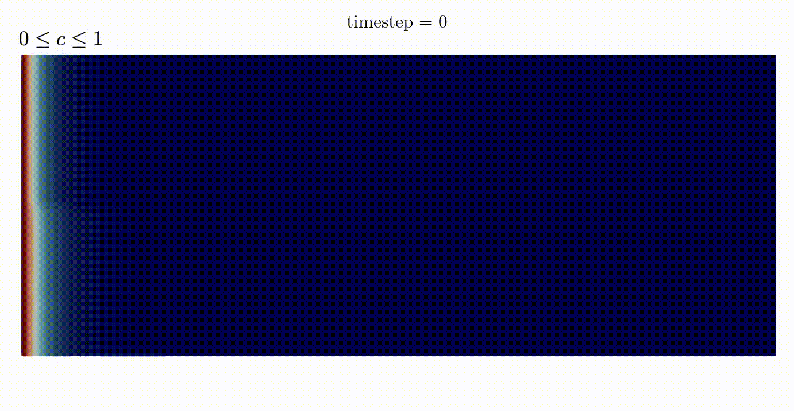

 <h1>Codes for implementation of a discontinuous Galerkin FE formulation for double porosity/permeability model</h1> 

>Codes for  
> Mohammad. S. Joshaghani, S. Hanie. S. Joodat, and Kalyana B. Nakshatrala
> "A stabilized mixed discontinuous Galerkin formulation for double porosity/permeability model" <i>[Computer Methods in Applied Mechanics and Engineering Journal](https://www.sciencedirect.com/science/article/abs/pii/S0045782519302075?dgcid=author)</i>, 352: 508-560, 2019 
> [Available in [arXiv](https://arxiv.org/abs/2106.11807)].
> 

[Abstract]

>Modeling flow through porous media with multiple pore-networks has now become an active area of research due to recent technological endeavors like geological carbon sequestration and recovery of hydrocarbons from tight rock formations. Herein, we consider the double porosity/permeability (DPP) model, which describes the flow of a single-phase incompressible fluid through a porous medium exhibiting two dominant pore-networks with a possibility of mass transfer across them. We present a stable mixed discontinuous Galerkin (DG) formulation for the DPP model. The formulation enjoys several attractive features. These include: (i) Equal-order interpolation for all the field variables (which is the most convenient for computer implementation) is stable under the proposed formulation. (ii) The stabilization terms are residual-based, and the stabilization parameters do not contain any mesh-dependent parameters. (iii) The formulation is theoretically shown to be consistent, stable, and hence convergent. (iv) The formulation supports non-conforming discretization and distorted meshes. (v) The DG formulation has improved element-wise (local) mass balance compared to the corresponding continuous formulation. (vi) The proposed formulation can capture physical instabilities in coupled flow and transport problems under the DPP model. 
>

>

>
In this repository, we have provided computer codes for a recently developed DG formulation of double porosity/permeability (DPP) model, which describes the flow of a single-phase incompressible fluid in a rigid porous medium with two distinct pore-networks with possible mass transfer across them. The proposed method provides accurate results even for disparate material properties, captures physical instabilities while eliminating numerical artifacts, and supports non-conforming discretizations. This repo entails [codes](./Codes/) for solving the coupled flow-transport in the heterogeneous porous medium. More details are discussed in the paper.

## Representative results

This video shows the evolution of concentration profile for coupled DPP flow and transport problem in medium (top) and [layered heterogeneous](./Video/VF_Schematic.svg) medium (bottom). It is evident that the proposed stabilized mixed DG formulation is capable of capturing viscous-fingering-type instabilities in a porous domain with two pore-networks. The proposed stabilized mixed DG formulation 
only eliminates spurious numerical instabilities but it does not suppress physical instabilities. In layered domain (bottom), fingers are propagating at a higher rate in the bottom layer with higher macro- and micro-permeabilities.

## Related links
<ul>
<li> 

My <a href="./Video/EMI_poster.pdf" target="_blank"> poster presentation</a> at Engineering Mechanics Institute (EMI) Conference, MIT, MA, May 2018.
</li>
</ul>
